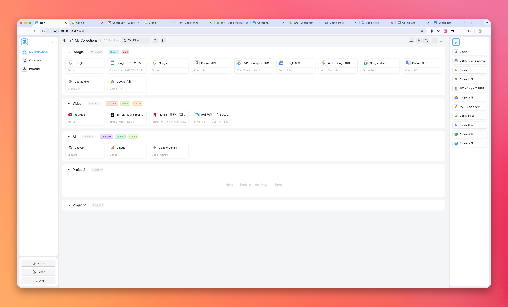
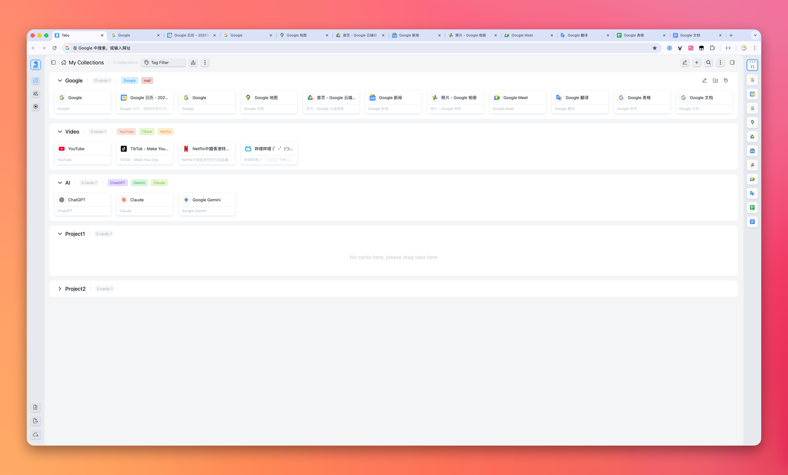
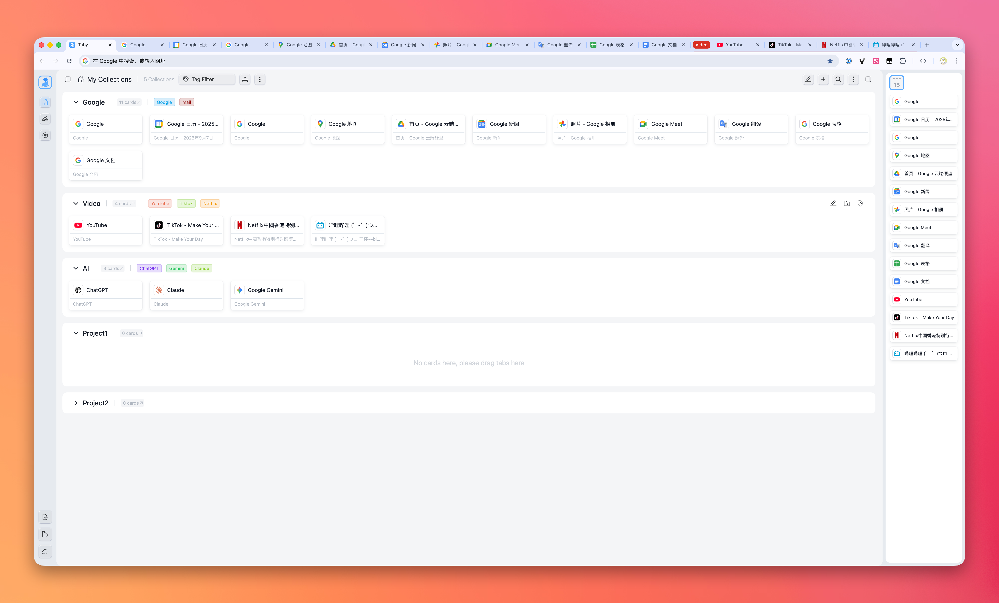
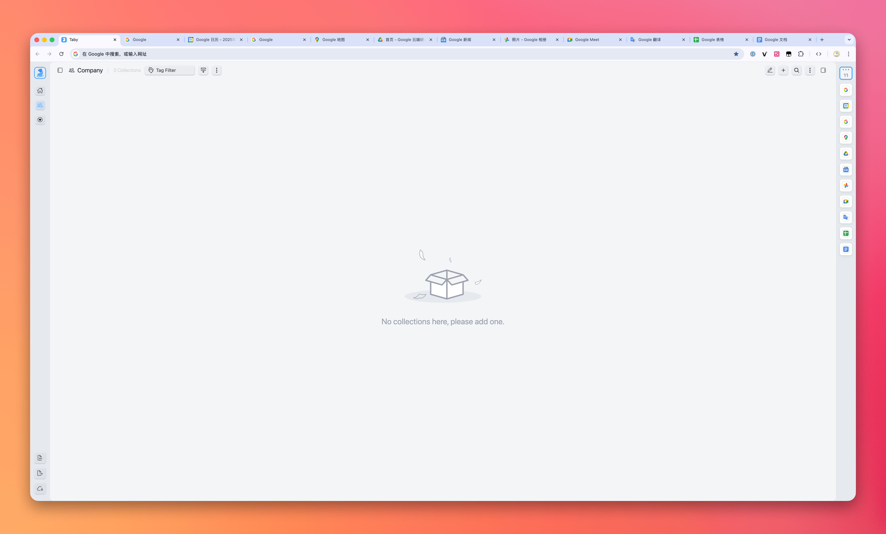
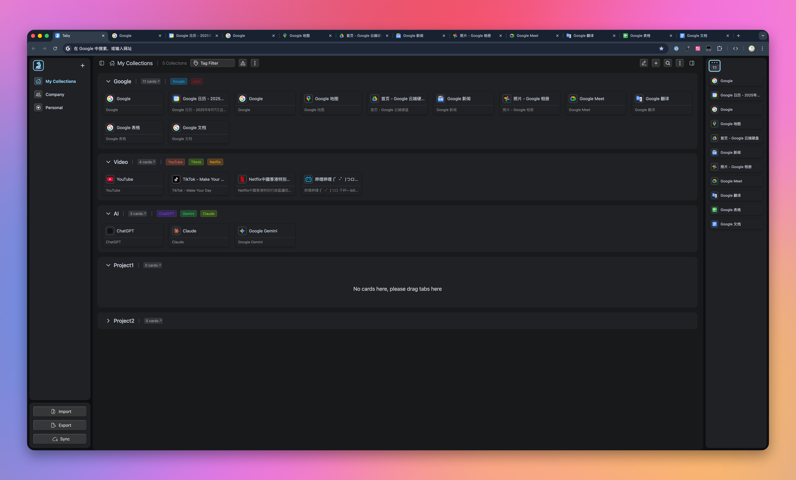

<div align="center">
  
  <h1>Taby</h1>
  <p><strong>简洁而强大的新标签页扩展</strong></p>
  <p><strong>A simple yet powerful new tab extension</strong></p>

  <p>
    
    
    
    
  </p>
</div>

## 📖 简介 | Introduction

Taby 是一款简约而功能丰富的浏览器新标签页扩展，旨在提升您的浏览体验和工作效率。个性化您的新标签页，轻松访问常用网站，并获取实用工具。

## ✨ 特性 | Features

- 🗂️ **标签页分组管理** - 将网站按类别整理，井然有序
- 🔄 **拖拽排序** - 自由调整标签和分组顺序
- 💾 **本地数据持久化** - 无需担心数据丢失
- ☁️ **GitHub Gist 同步** - 跨设备同步您的设置与数据，查看 [教程](gist.md)
- 📱 **响应式布局** - 完美适配各种屏幕尺寸
- 🌈 **主题切换** - 多种主题可供选择
- 🔍 **全局搜索功能** - 快速找到您需要的内容
- 🔖 **标签筛选** - 轻松筛选和管理您的标签
- 🌙 **暗黑模式** - 保护您的眼睛
- 🎨 **简洁美观的界面** - 现代化设计，视觉享受

## 📷 截图 | Screenshots

<div align="center">
  
    <br>
    <br>
  
    <br>
    <br>
  
    <br>
    <br>
  
    <br>
    <br>
  
</div>

## 🚀 安装 | Installation

### 浏览器应用商店 | Browser Extension Stores

- [Chrome Web Store](https://chromewebstore.google.com/detail/taby/iifpdfmdgnaogfbdlbmekdphicaaipod)

## 🛠️ 开发 | Development

```bash
# 克隆仓库
git clone https://github.com/gp0119/Taby.git

# 进入项目目录
cd Taby

# 安装依赖
npm install

# 开发环境运行
npm run watch-build

# 构建生产版本
npm run build
```

## 🤝 贡献 | Contributing

欢迎贡献！请随时提交 Pull Request 或创建 Issue。

## 📄 许可 | License

[MIT](LICENSE)
