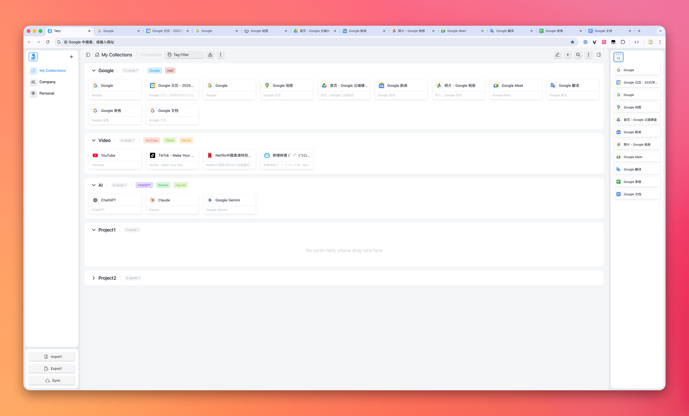
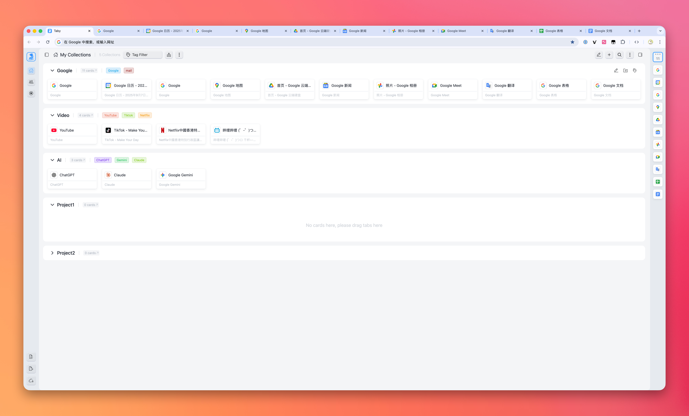
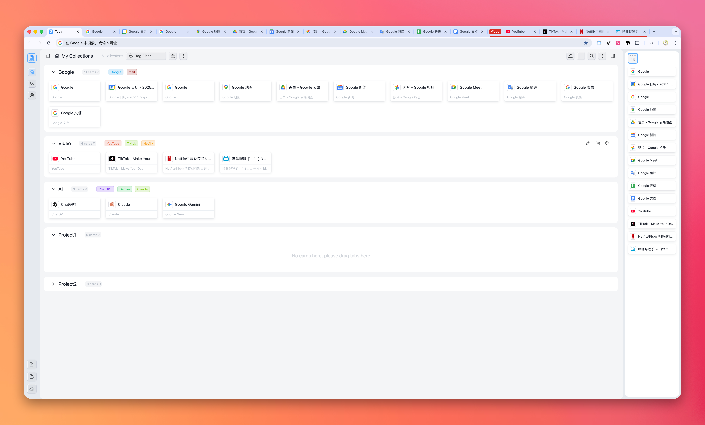
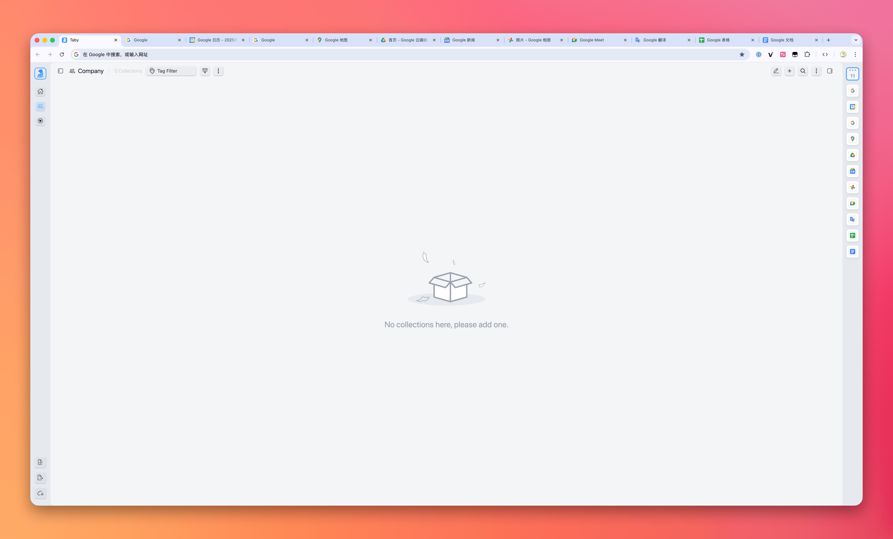
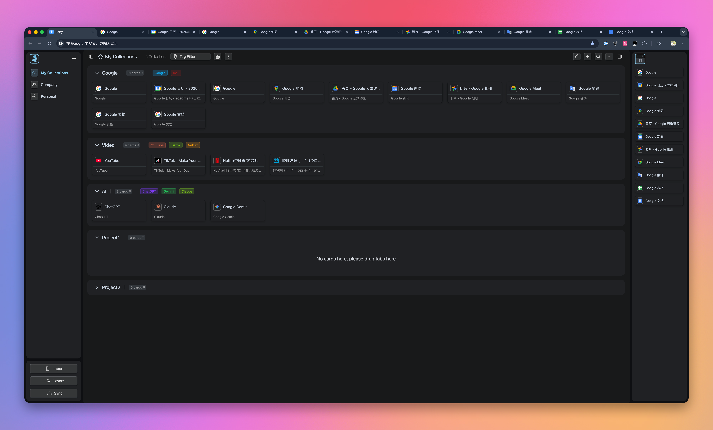

<div align="center">
  
  <h1>Taby</h1>
  <p><strong>在新标签页或 Web 中整理常用网站</strong></p>
  <p><strong>Organize your favorite sites in a new tab or on the Web</strong></p>

  <p>
    <a href="https://taby.noters.cn/">在线使用</a>
    ·
    <a href="https://chromewebstore.google.com/detail/taby/iifpdfmdgnaogfbdlbmekdphicaaipod">Chrome 扩展</a>
  </p>

  <p>
    
    
    
    
  </p>
</div>

## 📖 简介 | Introduction

Taby 是一款本地优先的网站整理工具，可作为浏览器新标签页扩展使用，也可直接在 Web 端访问。通过空间、收藏集和标签整理常用网站，并在不同设备间同步数据。

## ✨ 特性 | Features

- 🗂️ **灵活整理** - 使用空间、收藏集和标签管理网站
- 🔍 **快速查找** - 支持全局搜索与标签筛选
- 🔄 **高效管理** - 支持拖拽排序和批量操作
- 💾 **本地优先** - 数据默认保存在本地，支持导入与导出
- ☁️ **多端同步** - 支持 GitHub Gist、Gitee 和 WebDAV；[查看 Gist 教程](gist.md)
- 📱 **多种使用方式** - 支持 Chrome 扩展和响应式 Web 页面
- 🎨 **个性化显示** - 支持主题、暗黑模式和中英文界面

## 📷 截图 | Screenshots

<div align="center">
  
    <br>
    <br>
  
    <br>
    <br>
  
    <br>
    <br>
  
    <br>
    <br>
  
</div>

## 🚀 开始使用 | Get Started

- **Web：** [taby.noters.cn](https://taby.noters.cn/)
- **Chrome 扩展：** [Chrome Web Store](https://chromewebstore.google.com/detail/taby/iifpdfmdgnaogfbdlbmekdphicaaipod)

## 🛠️ 开发 | Development

```bash
git clone https://github.com/gp0119/Taby.git
cd Taby
pnpm install
```

| 命令                   | 用途                       |
| ---------------------- | -------------------------- |
| `pnpm dev`             | 启动扩展开发环境           |
| `pnpm dev:web`         | 启动 Web 开发环境          |
| `pnpm build:extension` | 构建扩展到 `dist/`         |
| `pnpm build:web`       | 构建静态网页到 `dist-web/` |
| `pnpm build:all`       | 同时构建扩展和静态网页     |

## 🤝 贡献 | Contributing

欢迎贡献！请随时提交 Pull Request 或创建 Issue。

## 📄 许可 | License

[MIT](LICENSE)
