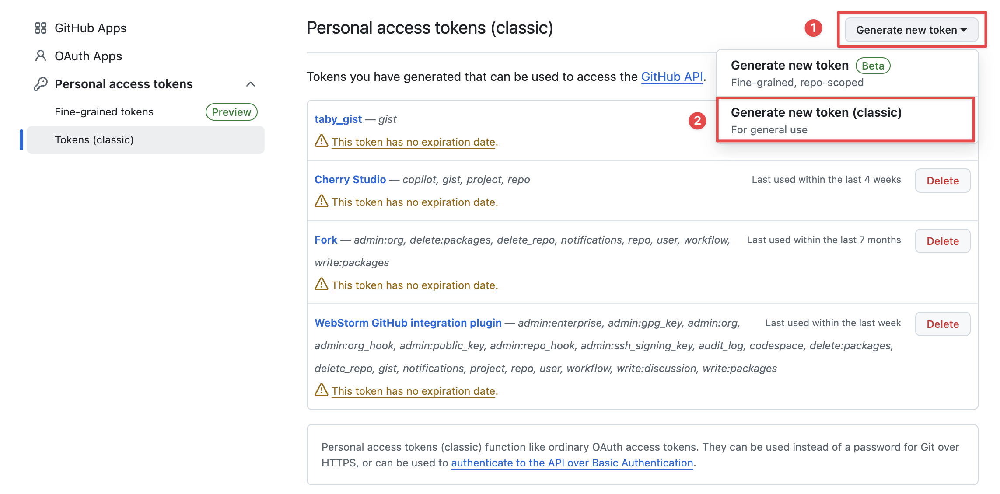
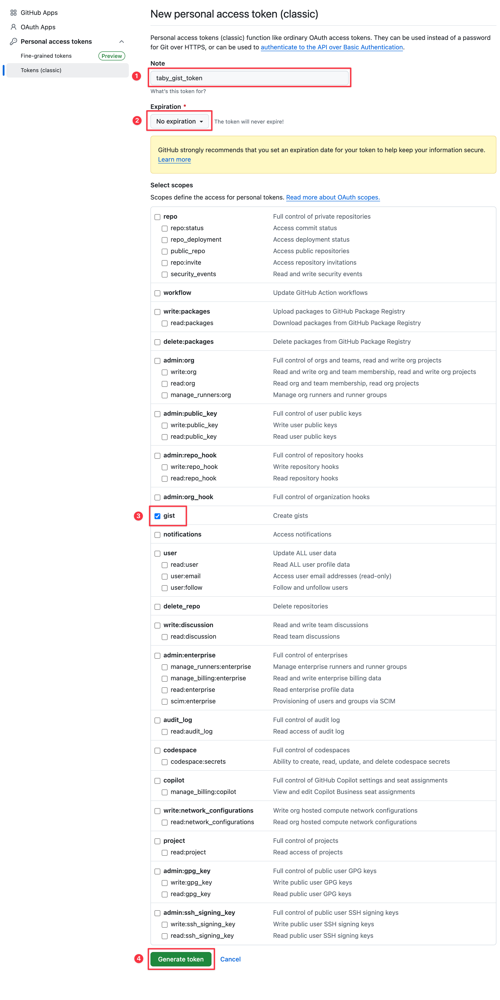
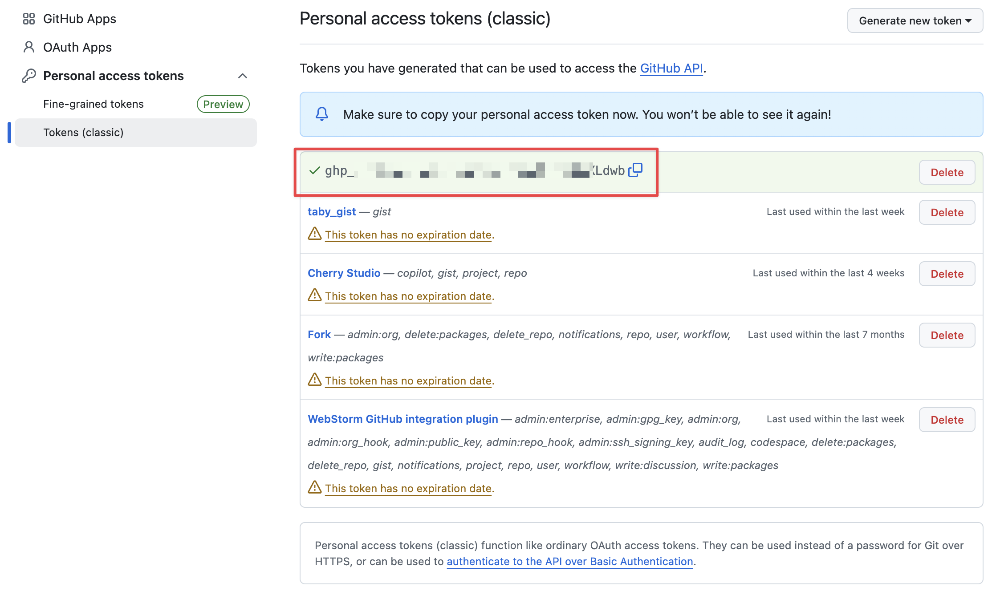
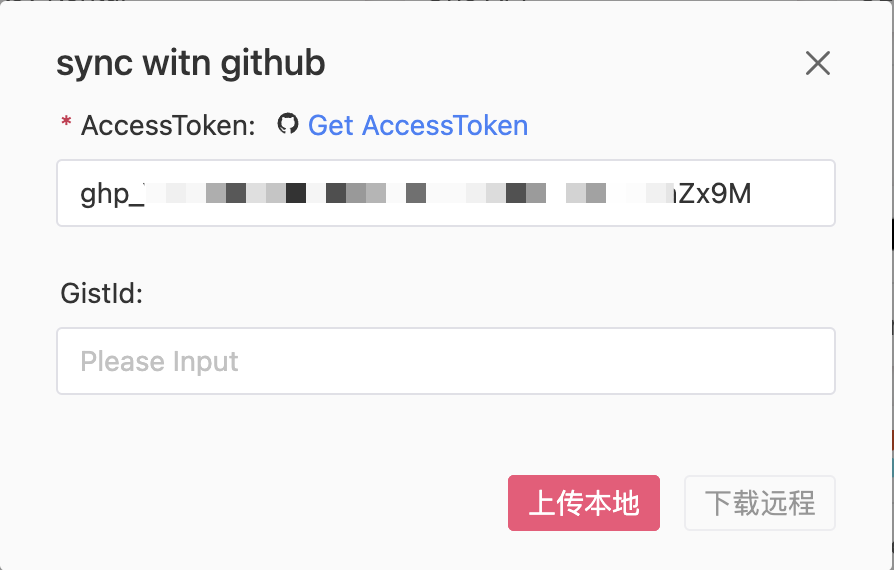
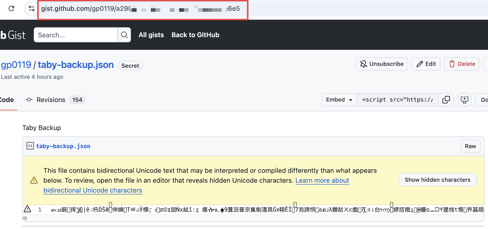

# GitHub Gist 同步教程

GitHub Gist 同步功能允许您在不同设备间无缝同步 Taby 的数据和设置。

## 1. 创建 GitHub 访问令牌 (Token)

1. 访问 [GitHub Personal Access Tokens 页面](https://github.com/settings/tokens)
2. 点击 "Generate new token" > "Generate new token (classic)"
3. 设置说明名称（如 "Taby Sync"）
4. 选择过期时间
5. 仅勾选 **gist** 权限
6. 点击页面底部的 "Generate token" 按钮
7. **重要：** 立即复制生成的令牌，它只会显示一次

  
    
  
    
  

## 2. 配置 Taby 同步设置

### 首次使用同步
1. 打开 Taby 设置页面，点击同步按钮
2. 输入您刚才复制的 GitHub Token
3. **无需输入 Gist ID**（首次同步会自动创建）
4. 点击 "上传本地数据" 按钮
5. 同步成功后，Gist ID 将自动填入

### 在其他设备同步
1. 输入相同的 GitHub Token
2. 输入已创建的 Gist ID（见下方如何获取）
3. 点击 "下载远程" 按钮

  

## 3. 查找您的 Gist ID

如果您需要手动获取 Gist ID（例如在其他设备上设置同步）：

1. 访问 [您的 GitHub Gist 页面](https://gist.github.com/)
2. 找到名为 "aby-backup.json" 的 Gist
3. Gist ID 是 URL 末尾的字符串：`https://gist.github.com/您的用户名/[Gist ID]`

  

## 注意事项

- 当您在商店安装 Taby 时，同步信息会由浏览器自动同步
- 手动安装的扩展需要每次都手动输入 Token 和 Gist ID
- 请妥善保管您的访问令牌